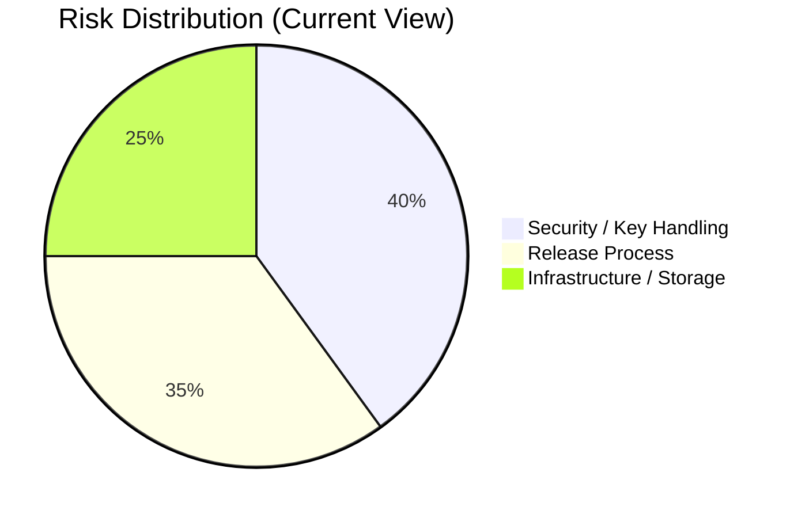

# OTA Manager (Confluence Macro Version)

Use this page when you want a Confluence-style document with callout sections.

## Copy/Paste Notes

- If your Confluence space supports wiki markup macros, use the blocks as-is.
- If your Confluence space is Cloud editor only, replace macro blocks with native panels using slash commands: /info, /warning, /note.

{info:title=Summary}
OTA Manager is an internal OTA release platform for uploading, activating, and securely delivering mobile bundle updates. It reduces release cycle time and improves rollback control.
{info}

## 1) Objectives

{info:title=Primary Goals}

- Faster bundle release process
- Controlled activation and rollback
- Secure update delivery
- Tenant/owner-level isolation
  {info}

## 2) Scope

{note:title=In Scope}

- Admin auth and dashboard workflow
- Bundle group CRUD
- Android/iOS zip upload to R2
- Active version selection
- Signed URL + SHA-256 delivery metadata
  {note}

{warning:title=Out of Scope (Current)}

- Phased rollout percentages
- Multi-channel releases (beta/prod)
- Adoption analytics
- Delta patching
  {warning}

## 3) Architecture

{panel:title=System Components|borderStyle=solid|borderColor=#ccc|titleBGColor=#f4f5f7|bgColor=#ffffff}

- Client Admin UI: React + Vite
- API Server: Express + TypeScript
- DB: MongoDB
- Storage: Cloudflare R2
  {panel}

{panel:title=Auth Boundary|borderStyle=solid|borderColor=#ccc|titleBGColor=#f4f5f7|bgColor=#ffffff}

- Admin APIs (/api/auth, /api/bundle-groups): JWT cookie auth
- Update APIs (/api/updates/\*): x-ota-key header auth
  {panel}

## 4) OTA Release Workflow

1. Login to admin UI.
2. Create bundle version.
3. Upload androidBundle/iosBundle zip files.
4. Activate selected version.
5. Mobile client calls /api/updates/latest with x-ota-key.
6. API returns signed URLs and checksums.

## 4.1) Workflow Status Table

| Step                 | Owner            | Success Signal                               |
| -------------------- | ---------------- | -------------------------------------------- |
| Create version       | Release Admin    | New bundle group visible in list             |
| Upload files         | Release Admin    | Bundle URLs and hashes stored                |
| Activate             | Release Admin    | Target version marked active                 |
| Validate             | QA/Release Admin | /api/updates/latest returns expected version |
| Rollback (if needed) | Release Admin    | Previous stable version active again         |

## 5) API Snapshot

### Health

- GET /
- GET /health/db

### Admin Auth

- POST /api/auth/signup
- POST /api/auth/login
- POST /api/auth/logout
- GET /api/auth/me
- GET /api/auth/api-key
- POST /api/auth/api-key/regenerate

### Bundle Groups (JWT)

- POST /api/bundle-groups
- GET /api/bundle-groups
- GET /api/bundle-groups/:id
- PATCH /api/bundle-groups/:id
- DELETE /api/bundle-groups/:id
- POST /api/bundle-groups/:id/upload

### OTA Updates (x-ota-key)

- GET /api/updates/list
- GET /api/updates/latest
- GET /api/updates/:id

## 6) Example Response

{code:language=json}
{
"version": 103,
"downloadAndroidUrl": "https://...signed-url...",
"downloadIosUrl": "https://...signed-url...",
"sha256Android": "...",
"sha256Ios": "..."
}
{code}

## 7) Ops Runbook

{info:title=Publish New Bundle}

1. Create version
2. Upload files
3. Activate version
4. Verify /api/updates/latest
   {info}

{info:title=Rollback}

1. Select previous stable version
2. Set isActive=true
3. Re-verify latest endpoint
   {info}

{warning:title=API Key Rotation}
After regenerating OTA key, all consuming clients/configs must be updated to avoid update failures.
{warning}

## 8) Risks and Mitigations

- Risk: OTA key leak -> Mitigation: rotate key quickly and update clients.
- Risk: Wrong active version -> Mitigation: use publish checklist and validation step.
- Risk: R2 misconfiguration -> Mitigation: pre-release smoke check for signed URL download.

## 8.1) Risk Matrix Table

| Risk                     | Impact | Likelihood | Mitigation                                 |
| ------------------------ | ------ | ---------- | ------------------------------------------ |
| OTA key exposed          | High   | Medium     | Key rotation + restricted key distribution |
| Incorrect active version | Medium | Medium     | Publish checklist + endpoint verification  |
| Storage config issue     | High   | Low        | R2 smoke tests + alerting                  |

## 8.2) Visual Risk Distribution

## 9) Action Items / Roadmap

- Add phased rollout controls.
- Add release channels.
- Add audit logs.
- Add adoption metrics dashboard.

## 9.1) Roadmap Priority Table

| Initiative         | Priority | Expected Outcome               |
| ------------------ | -------- | ------------------------------ |
| Release channels   | High     | Better environment separation  |
| Phased rollout     | High     | Lower production blast radius  |
| Audit logs         | Medium   | Better traceability/compliance |
| Adoption dashboard | Medium   | Improved release visibility    |

## 10) Ownership

- Product Owner: (fill)
- Backend Owner: (fill)
- Frontend Owner: (fill)
- Ops Owner: (fill)

## 11) Revision

- 2026-04-17: Initial macro-oriented Confluence draft.
