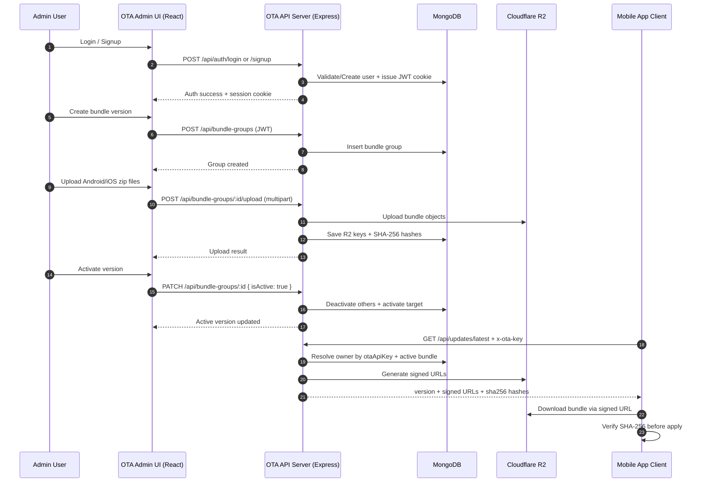
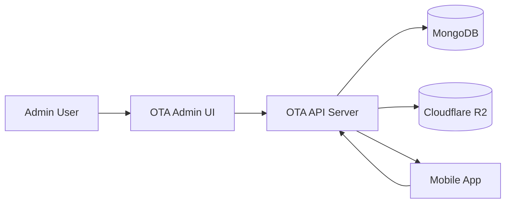
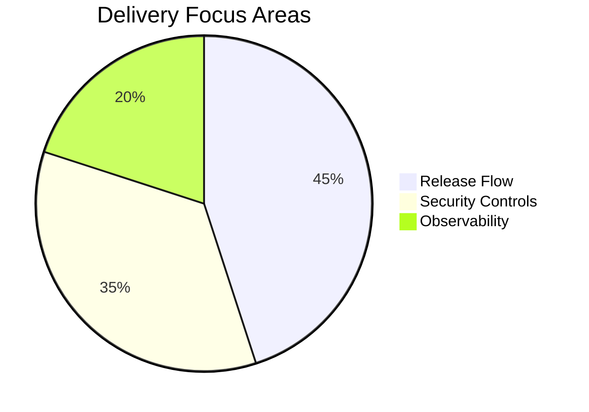

# OTA Manager Sequence Diagram (Mermaid)

This file provides a copy-ready Mermaid sequence diagram for Confluence pages that support Mermaid rendering.

## Diagram



## Architecture Flowchart



## Endpoint Ownership Table

| Endpoint Group     | Auth Mode  | Primary Consumer | Purpose                        |
| ------------------ | ---------- | ---------------- | ------------------------------ |
| /api/auth          | JWT cookie | Admin UI         | Account and session management |
| /api/bundle-groups | JWT cookie | Admin UI         | Version lifecycle and uploads  |
| /api/updates       | x-ota-key  | Mobile App       | OTA metadata and signed URLs   |

## Minimal Request/Response Example

### Request Header

```http
x-ota-key: <owner-ota-api-key>
```

### Response Example

```json
{
  "version": 103,
  "downloadAndroidUrl": "https://...signed-url...",
  "downloadIosUrl": "https://...signed-url...",
  "sha256Android": "...",
  "sha256Ios": "..."
}
```

## Confluence Usage Notes

- If Mermaid macro is available: paste the diagram block directly.
- If Mermaid is not available: export diagram image and embed it in the page.
- Keep endpoint names and auth notes visible near the diagram for cross-team clarity.

## Rollout Focus Chart



## Last Updated

- 2026-04-17
