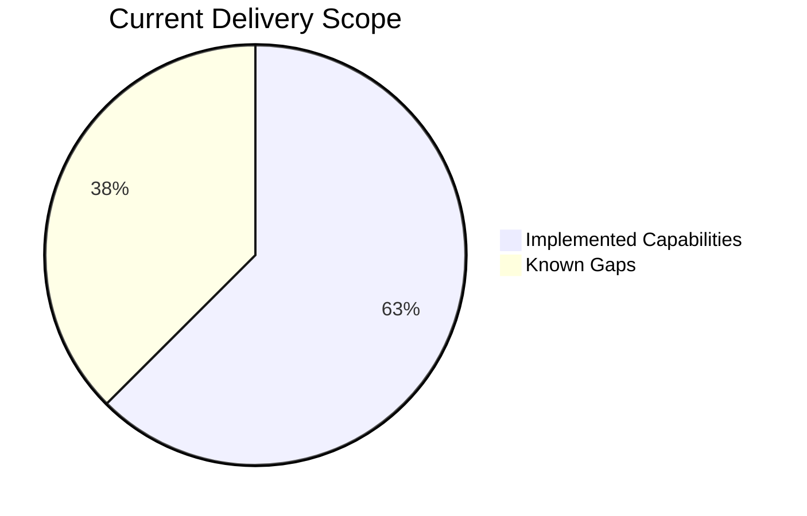

# OTA Manager One-Pager (Non-Engineering Audience)

## What Is OTA Manager?

OTA Manager is an internal tool that lets our team publish mobile app bundle updates faster, without waiting for a full app store release cycle.

It provides a controlled process to upload Android/iOS bundles, activate a target version, and deliver that version securely to client apps.

## Why We Built It

- Speed up hotfix and feature delivery.
- Reduce dependency on app store release timing.
- Give product and engineering teams better release control.
- Improve reliability with version visibility and rollback capability.

## Who Uses It

- Release/Admin team: publishes and activates OTA bundles.
- Mobile apps: request latest bundle metadata and download updates.

## How It Works (Simple)

1. Admin logs in to OTA Manager.
2. Admin creates a version and uploads Android/iOS bundle zip files.
3. Admin marks one version as active.
4. Mobile app asks OTA API for latest active version.
5. API responds with signed download links and file checksums.
6. Mobile app downloads and verifies integrity before applying update.

## Security At a Glance

- Admin dashboard access uses secure login session.
- Mobile update endpoints require an OTA API key.
- Bundle files are served using signed URLs (time-limited access).
- SHA-256 checksums are provided for integrity verification.

## Current Capabilities

- Manage bundle versions per owner/team.
- Upload Android and iOS bundle zip files.
- Activate/deactivate versions.
- Return latest version metadata to mobile clients.
- Rotate OTA API keys.

## Capability Table

| Area                    | What Team Can Do Today                         | Benefit                        |
| ----------------------- | ---------------------------------------------- | ------------------------------ |
| Release Management      | Create and activate OTA versions               | Faster release turnaround      |
| Multi-Platform Delivery | Upload Android and iOS bundles separately      | Platform flexibility           |
| Security                | Use OTA API key + signed URLs                  | Controlled access              |
| Reliability             | Provide SHA-256 checksums with update metadata | Integrity verification         |
| Operations              | Roll back by re-activating previous version    | Reduced incident recovery time |

## Current Limitations

- No phased rollout percentages yet.
- No channel model (beta/staging/production) yet.
- No built-in adoption analytics dashboard yet.

## Scope Snapshot Chart

## Team Ownership Table

| Function              | Primary Responsibility | Backup              |
| --------------------- | ---------------------- | ------------------- |
| Product Decisions     | Product Owner          | Engineering Manager |
| API and Storage       | Backend Owner          | Platform Engineer   |
| Dashboard UX and Flow | Frontend Owner         | Fullstack Engineer  |
| Release Operations    | Ops Owner              | On-call Engineer    |

## Operational Playbook (Quick)

### Publish New Version

1. Create version.
2. Upload bundles.
3. Activate version.
4. Validate latest endpoint.

### Rollback

1. Select previous stable version.
2. Mark it active.
3. Verify latest endpoint response.

### Rotate API Key

1. Regenerate key in settings.
2. Update consuming clients/config.
3. Verify update requests with new key.

## Business Value Summary

OTA Manager reduces release friction, improves response time for fixes, and introduces a safer, more controlled OTA update process for the team.

## Ownership

- Product Owner: (fill)
- Backend Owner: (fill)
- Frontend Owner: (fill)
- Ops Owner: (fill)

## Last Updated

- 2026-04-17
